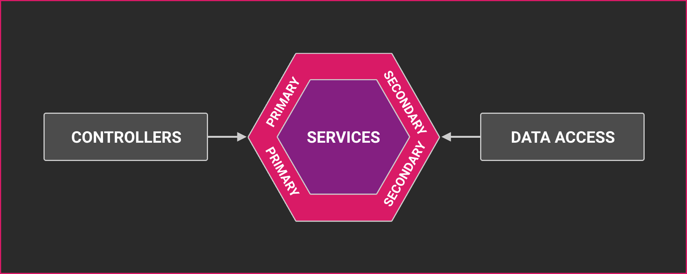

# Arquitetura

## Tabela de Documentação<!-- omit in toc -->

- [Arquitetura](#arquitetura)
  - [Arquitetura Hexagonal](#arquitetura-hexagonal)
  - [Motivação](#motivação)
  - [Descrição da Estrutura de Módulos](#descrição-da-estrutura-de-módulos)
  - [Recomendações](#recomendações)
    - [Padrão Repository](#padrão-repository)

## Arquitetura Hexagonal

Está aplicação é baseada na [Arquitetura Hexagonal](<https://en.wikipedia.org/wiki/Hexagonal_architecture_(software)>), mais conhecida como: Ports and Adapters.



## Motivação

A principal razão para usar a Arquitetura Hexagonal é separar a lógica de negócios da infraestrutura. Essa separação permite trocar facilmente de banco de dados, o driver de upload de arquivos ou qualquer outra infraestrutura sem alterar a lógica de negócios, sem falar que os testes também não estarão acoplados.

## Descrição da Estrutura de Módulos

```txt
.
├── domain
│   └── [DOMAIN_ENTITY].ts
├── dto
│   ├── create.dto.ts
│   ├── find-all.dto.ts
│   └── update.dto.ts
├── infrastructure
│   └── persistence
│       ├── relational
│       │   ├── entities
│       │   │   └── [ENTITY].ts
│       │   ├── mappers
│       │   │   └── [MAPPER].ts
│       │   ├── relational-persistence.module.ts
│       │   └── repositories
│       │       └── [ADAPTER].repository.ts
│       └── [PORT].abstract.ts
├── controller.ts
├── module.ts
└── service.ts
```

`[DOMAIN ENTITY].ts` representa uma entidade usada na lógica de negócios. A entidade de domínio não possui dependências no banco de dados ou em qualquer outra infraestrutura.

`[ENTITY].ts` representa a **estrutura do banco de dados**. É usado em banco de dados relacional (PostgreSQL).

`[MAPPER].ts` é um mapeador que converte **entidade do banco de dados** para **entidade de domínio** e vice-versa.

`[PORT].abstract.ts` é uma **porta** de repositório que define os métodos/contratos para interação com o banco de dados.

`[ADAPTER].repository.ts` é um repositório que implementa o **[PORT].repository.ts**. É usado para interagir com o banco de dados.

`infrastructure` pasta - ontém todos os componentes relacionados à infraestrutura, como **persistence**, **uploader**, **senders**, etc.

Cada componente tem `port` e `adapters`. O `Port` é uma interface que define os métodos para interagir com a infraestrutura. Os `Adapters` são implementações do `port`.

## Recomendações

### Padrão Repository

Não crie métodos universais no repositório, pois eles são difíceis de estender durante a vida útil do projeto. Em vez disso, crie métodos com responsabilidades únicas seguindo os principios do SOLID.

```typescript
// ❌
export class UsersRelationalRepository implements UserRepository {
  async find(condition: UniversalConditionInterface): Promise<User> {
    // ...
  }
}

// ✅
export class UsersRelationalRepository implements UserRepository {
  async findByEmail(email: string): Promise<User> {
    // ...
  }

  async findByRoles(roles: string[]): Promise<User> {
    // ...
  }

  async findByIds(ids: string[]): Promise<User> {
    // ...
  }
}
```

---

Anterior: [Instalação e Execução](installing-and-running.md)

Próximo: [Banco de dados](database.md)
